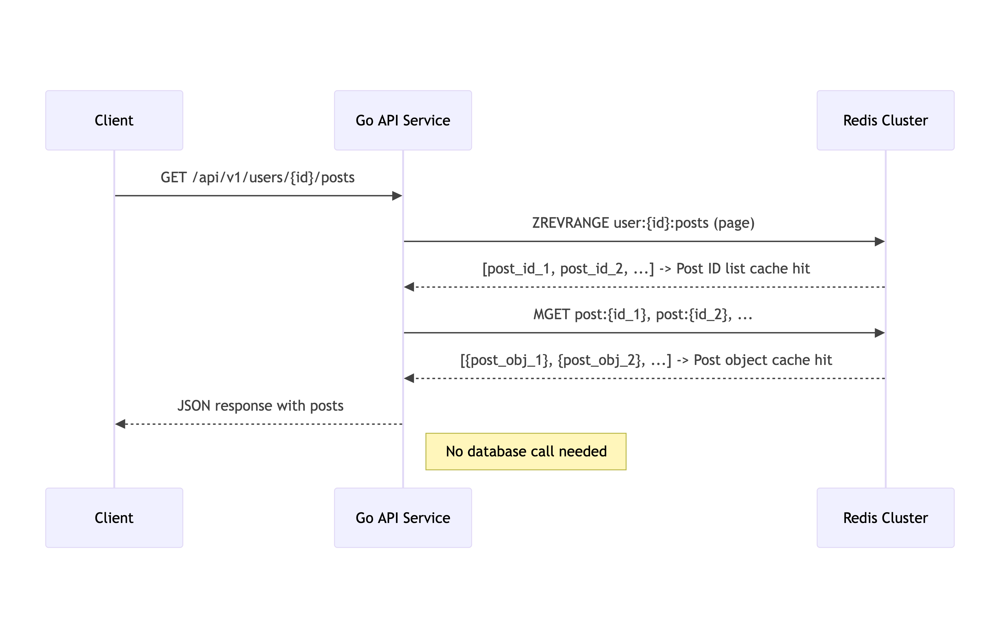

# Redis Cluster Query Aggregator

This project is a sample application demonstrating a query aggregation layer for a Redis Cluster. In a sharded data environment, like social media feed partitioned by `userId` and social media post partitioned by `postId`, certain partitions can become "hot," receiving a disproportionate amount of traffic. While Redis Cluster handles data sharding, retrieving data that spans multiple shards (e.g., a user's feed composed of content from multiple other users) requires fetching from each shard and merging the results.

This application simulates this scenario by storing social media posts in a PostgreSQL database and implementing a caching and query aggregation layer with Redis Cluster.

## Prerequisites
*   Docker Desktop (or Docker Engine + Docker Compose)
*   Go (version 1.24+ for local development if not using Docker exclusively)
*   Make (optional, for Makefile commands if added in the future)

## Getting Started

### 1. Clone the Repository

```bash
git clone <your-repository-url>
cd <your-project-directory>
```

### 2. Environment Setup

Copy the example environment file and customize it if necessary:
```bash
cp .env.example .env
```

### 3. Running the Application

#### Production-like Environment
This command builds the production-ready image and starts all services (app, db, redis). The entrypoint script will automatically run database migrations.

```bash
docker compose up --build
```
The application will be accessible at http://localhost:${APP_PORT} (default: http://localhost:8080).

#### Development with Live Reload (Air)
For development, you can use the dev override compose file to enable live reloading with Air.

```bash
docker compose -f compose.yml -f compose.dev.yml up --build
```

Changes to Go files (and other specified extensions in .air.toml) will trigger an automatic rebuild and restart of the application.

#### Development with Debugging (Delve)

Similarly, for debugging with Delve, you can use the debug override compose file to enable delve debugger with breakpoints.

```bash
docker compose -f compose.yml -f compose.debug.yml up --build
```

Use dlv CLI or Goland debugger as Go remote configuration.

You can then attach your Go IDE's debugger to localhost:2345.

### 4. Set up redis cluster
Run this command once after docker compose is running to create a redis cluster 
```bash
docker compose exec redis-1 redis-cli --cluster create 173.18.0.2:6379 173.18.0.3:6379 173.18.0.4:6379 173.18.0.5:6379 173.18.0.6:6379 --cluster-replicas 0 --cluster-yes
```

### 5. Run migrate
Run this command once after docker compose is running to create Postgres schemas 
```bash
docker compose exec app migrate -path /app/db/migration -database "$DB_URL" up
```

## Demonstration

This section walks you through generating sample data, querying it, and observing the caching behavior.

### 1. Generate Sample Data

First, we need to populate the database with users and posts. The project includes a data generator for this purpose. The generator creates 100 users and 2,000,000 posts, with a skewed distribution to simulate hot partitions (some users will have significantly more posts than others).

Run the data generator inside the `app` container, which has all the necessary environment variables configured:

```bash
docker compose exec app go run cmd/datagen/main.go
```

You'll see output indicating the progress of user and post creation. This process may take a few minutes.

### 2. Query a User's Posts and Observe Caching

Once the data is generated, you can query the API to fetch posts for a specific user. Let's try to get posts for `user_id=1`, which is one of the users with a high number of posts.

#### First Request (Cache Miss)

Open a terminal and run the following command. The `time` command will show how long the request takes.

```bash
time curl -X GET http://localhost:8080/api/v1/users/1/posts
```

You'll receive a JSON response with a paginated list of posts. Since this is the first time we're requesting this data, the service experiences a **cache miss** and has to query the database. Note the execution time.

```json
{
    "data": [
        {
            "id": 2000000,
            "user_id": 1,
            "content": "This is post content 2000000 generated by datagen. UserId is 1. Random data: ...",
            "created_at": "2025-08-20T12:00:00Z",
            "updated_at": "2025-08-20T12:00:00Z"
        }
    ],
    "has_more": true,
    "limit": 50,
    "offset": 0
}
```
*(Note: The actual post data will vary. The response is paginated, showing 50 posts by default.)*

#### Second Request (Cache Hit)

Now, run the exact same command again:

```bash
time curl -X GET http://localhost:8080/api/v1/users/1/posts
```

You should notice that the response time is significantly faster. This is because the data is now served entirely from the Redis cache, resulting in a **full cache hit**.

### 3. Check Prometheus Metrics

The application exposes Prometheus metrics. You can view them by navigating to `http://localhost:8080/metrics` in your browser or using `curl`.

After running the queries above, you will be able to observe the caching behavior through metrics. Look for metrics related to caching.

**After the first request (cache miss):**
```
# HELP post_list_cache_misses_total Total misses for post list cache
# TYPE post_list_cache_misses_total counter
post_list_cache_misses_total{user_id="1"} 1
```

**After the second request (cache hit):**
```
# HELP post_list_cache_hits_total Total hits for post list cache
# TYPE post_list_cache_hits_total counter
post_list_cache_hits_total{user_id="1"} 1
# HELP post_object_cache_hits_total Total hits for post object cache
# TYPE post_object_cache_hits_total counter
post_object_cache_hits_total 50
```
*(Note: The exact metric names and labels might differ. The counts reflect one miss for the list query, followed by one hit for the list and 50 hits for the individual post objects on the default page.)*

### What's Happening in the Background?

The behavior you observed is due to a two-level caching strategy implemented in the service:

1.  **Initial Request (Cache Miss):**
    *   The application receives a request for a user's posts (e.g., `/users/1/posts`).
    *   It first checks Redis for a cached list of post IDs for that specific query (e.g., using a key like `user:1:posts:page:1`). It doesn't find one. This is a **post list cache miss**.
    *   The service then queries the PostgreSQL database to get the required page of posts for `user_id=1`.
    *   After retrieving the data from the database, the service performs two caching operations in a Redis pipeline for atomicity and performance:
        1.  It caches each individual post object retrieved, using its ID as the key (e.g., `post:123`, `post:124`, etc.). This populates the item-level cache.
        2.  It caches the list of post IDs for the specific query, storing the array of IDs under the query's key (e.g., `user:1:posts:page:1`).
    *   Finally, it assembles the post objects and returns them to the client.

2.  **Subsequent Request (Cache Hit):**
    *   The application receives the same request again.
    *   It checks Redis for the cached list of post IDs (`user:1:posts:page:1`) and finds it. This is a **post list cache hit**.
    *   The service now has a list of post IDs retrieved from the cache (e.g., `[123, 124, ...]`).
    *   It then uses a single Redis `MGET` command to fetch all the corresponding post objects from the cache in one round trip (e.g., `MGET post:123 post:124 ...`). Since we cached these objects during the first request, this results in multiple **post object cache hits**.
    *   The application aggregates these results and returns the response to the client, completely avoiding a database query.

This strategy effectively offloads read traffic from the primary database to the Redis cache, improving response times and scalability, especially for "hot" users whose posts are frequently requested. The use of Redis Cluster ensures that this caching layer can scale horizontally as well.

## Architecture and Data Flow

### High-Level Architecture

The diagram below illustrates the high-level architecture of the system. A client interacts with the Go API, which in turn communicates with PostgreSQL for persistent storage and Redis Cluster for caching.


### Data Flow for `ListPostsByUser`
The following diagrams show the data flow for the `ListPostsByUser` endpoint, highlighting the difference between a cache miss and a cache hit.

#### Cache Miss
On the first request for a user's posts, the data is not in the cache. The application fetches it from the database and populates the cache for subsequent requests. The caching operations are performed atomically within a Redis Pipeline.


#### Cache Hit

On subsequent requests, the data is served directly from Redis, resulting in a much faster response and no load on the database.



## Key Concepts Demonstrated
*   **Query Aggregation**: A service layer that intelligently queries multiple Redis shards and combines the results.
*   **Hot Partition Simulation**: Demonstrates how to handle scenarios where data for specific user-generated content becomes highly requested.
*   **Cache Sharding**: Utilizes Redis Cluster for distributed caching.
*   **Go Backend**: A robust API built with Go, Gin, `sqlc`, and `pgx`.
*   **Containerized Environment**: Fully containerized setup with Docker and Docker Compose for easy local development and deployment.


## Project Structure (Simplified)
```text
. 
├── cmd/server/main.go    # Application entry point
├── config/               # Configuration loading
├── db/
│   ├── migration/        # Database migration files (.sql)
│   ├── queries/          # SQL queries for sqlc
│   └── sqlc/             # Generated Go code by sqlc
├── internal/
│   ├── handler/          # HTTP handlers (Gin)
│   ├── repository/       # Database interaction logic
│   ├── router/           # API route definitions
│   └── service/          # Business logic
├── scripts/
│   └── entrypoint.sh     # Docker entrypoint script for prod
├── .air.toml             # Air configuration for live reload
├── Dockerfile            # Docker build instructions
├── compose.yml           # Docker Compose configuration
├── go.mod                # Go module definition
├── sqlc.yaml             # sqlc configuration
└── README.md             # This file
```

## Database Migrations (golang-migrate/migrate)

Migration files are located in `db/migration/`. The migrate CLI tool is included in the Docker images (dev-common and prod stages).

### Creating a New Migration

To create a new migration file (e.g., add_new_feature), run the following command locally if you have migrate installed, or execute it inside a running app container:

#### Locally (if migrate CLI is installed)
```bash
migrate create -ext sql -dir db/migration -seq add_new_feature
```

#### Inside the app container (ensure the app service is running, e.g., via dev compose setup)
```bash
docker compose exec app migrate create -ext sql -dir /app/db/migration -seq add_new_feature
```

This will create two files in `db/migration/` (e.g., 00000X_add_new_feature.up.sql and 00000X_add_new_feature.down.sql). Edit these files to define your schema changes.

#### Running Migrations Manually

The entrypoint.sh script in the prod target automatically runs migrate ... up on container startup. However, you can run migrations manually against the database service managed by Docker Compose.

Ensure your .env file is configured, especially DB_URL (or POSTGRES_URL from which DB_URL is derived for the entrypoint). The migrate command inside the container will use the DB_URL environment variable.
- Apply all pending up migrations:
   ```bash
   docker compose exec app migrate -path /app/db/migration -database "$DB_URL" up
   ```
- Rollback the last down migration:
   ```bash
   docker compose exec app migrate -path /app/db/migration -database "$DB_URL" down 1
   ```
- Migrate to a specific version:
   ```bash
   docker compose exec app migrate -path /app/db/migration -database "$DB_URL" goto VERSION_NUMBER
   ```
- Force a specific version (useful for fixing dirty state):
   ```bash
   docker compose exec app migrate -path /app/db/migration -database "$DB_URL" force VERSION_NUMBER
   ```

## SQLC (SQL Code Generation)

sqlc generates Go code from your SQL queries located in `db/queries/`. The sqlc CLI is included in the Docker images. Configuration is in sqlc.yaml.

### Generating Go Code
After making changes to your SQL queries in `db/queries/` or updating `sqlc.yaml`, you need to regenerate the Go code.
```bash
docker compose exec app sqlc generate --path /app/sqlc.yaml
```

The generated Go files will be placed in `db/sqlc/` as specified in `sqlc.yaml`. Remember to commit these generated files to your repository.

## API Endpoints
Currently implemented user endpoints:
- POST /api/v1/users: Create a new user.
- GET /api/v1/users/:id: Get a user by their ID.
- GET /api/v1/users/:id/posts: Get a paginated list of posts by user ID
- POST /api/v1/posts: Create a new post.
- GET /api/v1/posts/:id: Get a user by their ID.
- GET /ping: Healthcheck
- GET /metrics: Prometheus metrics log dumps
